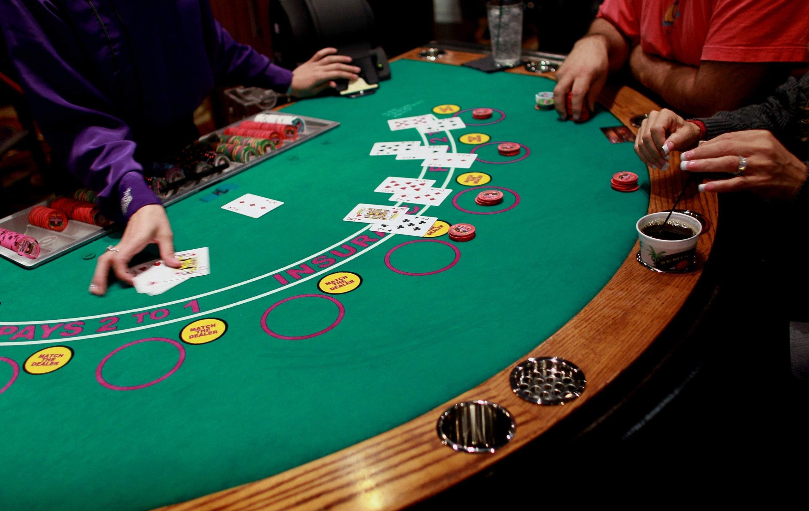
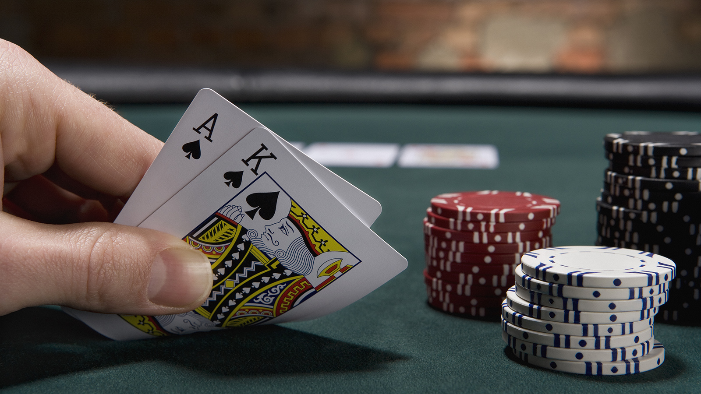

# Blackjack
-------------
Para este primer projecto me he decantado por crear un programa que emule el juego del 21 blacjack, uno de los juegos de apuestas más populares de todos los casinos, y que tiene una dinámica bastante sencilla.

## [Reglas](https://es.wikipedia.org/wiki/Blackjack)

En una mesa típica de blackjack, cada jugador apuesta contra el repartidor o *dealer*. Este reparte un juego de 52 cartas, previamente barajadas, a cada uno de los juegadores y a sí mismo el último, haciendo dos rondas y dando una carta a cada jugador, bocarriba, y dejando las suyas boca abajo, en cada una de las rondas.

Una vez la mesa está repartida, el dealer deja al descubierto una de sus dos cartas, y hace una ronda para que cada jugador decida si necesita cartas adicionales o no. Una vez todos los jugadores han pasado, el *dealer* descubre su otra carta, y, si es necesario, extrae cartas adicionales hasta que la suma de sus cartas sea igual o mayor a 17.

El valor de las cartas es:
- Cartas del 2 al 10: su valor.
- Figuras: todas valen 10.
- Ases: pueden valer 1 o 11, según convenga al jugador.

Gana quien:
- Consiga un blackjack: 2 o 3 cartas que juntas sumen 21.
- Consiga 21 puntos: en más de 3 cartas.
- El valor de sus cartas sea mayor que el de su oponente, pero no mayor que 21.

Pierde quien:
- Consiga un valor mayor que 21.

#### Existe la posibilidad de empate

## Planteamiento del programa

El programa está dividido en dos archivos, uno con las funciones (*blackjack_functions.py*); y otro encargado de lanzar el programa (*launcher.py*)

### Funciones

Analizando la dinámica del juego, el primer problema al que me enfrenté fue al de **crear una mesa y un juego de cartas barajadas.**

Para la mesa he creado la función *set_table()*, que toma como único argumento el número de jugadores que se sentarán (previamente preguntado al usuario en el launcher), y pregunta el nombre a cada jugador. Con estos datos general y devuelve un diccionario con los nombres de los jugadores (mas el Dealer) como *keys*, y una lista vacía como *values*. Dicha lista albergará las cartas una vez repartidas.

Para el juego de cartas he creado la función *card_shuffler*, sin argumentos, y que incluye una lista con tres listas anidadas. Cada una de estas incluye otra lista con todas las cartas de un palo separadas: el As por un lado, cartas del 2 al 10 por otro, y figuras. Otra lista incluye los nombres de los palos: 'C' para *Clubs*, 'D' para *diamonds*, 'H' para *hearts* y 'S' para *spades*.

Mediante un loop anidado, se van mezclando valores con palos, y cada carta se añade a una lista. Esta lista es 'barajada' mediante la función *shuffle* de la librería *random*, y devuelta por la función. Etas tres funciones se encuentran en el documento *table_cards.py*

Una vez la mesa está preparada llega el **primer reparto**, de dos cartas a cada jugador. Para hacer las veces de *dealer()*, he creado una *'generator function'*, cuyo argumento es el juego de cartas ya barajado, y que va cogiendo cartas según es llamada. 

La función *first_dealt* toma como argumentos el diccionario de la 'mesa', el número de jugadores y la función generadora con las cartas. Mediante un loop reparte, en dos rondas de una carta cada una, las cartas a cada jugador por orden; devolviendo después el diccionario con la mesa.

Otra función, *points_checker()*, llamada en otras funciones, **revisa en cada momento la puntuación de los jugadores** y qué valor está usando el jugador para el As (en caso de tenerlo en mano). Estas funciones se encuentran en el documento *deals_checker.py*

La **mesa es mostrada** al usuario mediante la función *status*, con una kwarg llamada *dealer_shows*, que señala cuando el *dealer* debe enseñar sus cartas y cuando no. Esta función llama a la anterior *points_checker()* dándole la lista que cada jugador tiene como value en el dictionario para que esta le devuelva otra lista con sólo los valores de cada carta (y los ases siendo 11 o 1 a conveniencia). 

Una vez recibe la puntuación, puede añadir un mensaje en caso de que el jugador tenga un blackjack, haya llegado a 21 o se haya pasado. Los jugadores que reciben uno de estos mensajes no serán preguntados por una carta nueva. En caso de no haber nada, imprime la mano del jugador y devuelve ua lista con los jugadores a los que el dealer debe preguntar en la **siguiente ronda** si quiren carta nueva o no. Esta función se encuentra en el documento *status.py*

De la segunda y el resto de rondas se encarga la función *new_deal()*, que toma como argumentos la mesa, la lista de los jugadores a los que debe preguntar, y el generador de cartas. Mediante un input, el jugador decide si quiere carta nueva ('y') o no ('n'). En caso de no quere carta, la función añade a la lista del jugador una nueva lista, con el mensaje **'PASS'** y un valor que servirá a la función *status()* para saber que ese jugador no quiere más cartas. Esta función se encuentra en *deals_checker.py*.

Una vez ningún jugador necesite más cartas llega el momento en el que **el *dealer* enseña su segunda carta** (mediante la función *status*, con el argumento *dealer_show* marcado como True). 

En caso de que el dealer no haya obtenido un valor de 17 o más, la función *dealer_get()*, cuyos argumetos son la mesa y el generador, le **repartirá cartas hasta que llegue a 17 o más, pase los 21 o consiga blackjack**. Como la función *status()*, *dealer_get()* mostrará mensajes en caso de que el *dealer* consiga blackjack o pierda. 

Esta función, además, es capaz de otorgar a conveniencia valores de los ases. Por ejemplo: si en una primera ronda el *dealer* recibe un As y un 2 (13), necesitará otra carta para llegar a 17. Si esa carta fuese otro As, la función sabrá que ese segundo As debe tener valor de 1, siendo el valor total de la mano 14 y no 24 de contar ambos ases como 11. Esta función se encuentra en el documento *dealer_behaviour.py*.

Una vez el *dealer* ha recibido todas las cartas necesarias, la mesa final es mostrada a los usuarios; y la función *checker()*, que recibe como argumento el diccionario de dicha mesa final con todas las puntuaciones, decide quién ha ganado entre cada jugador y el *dealer* y lo muestra en la pantalla. Esta función se encuentra en *deals_checker.py*

