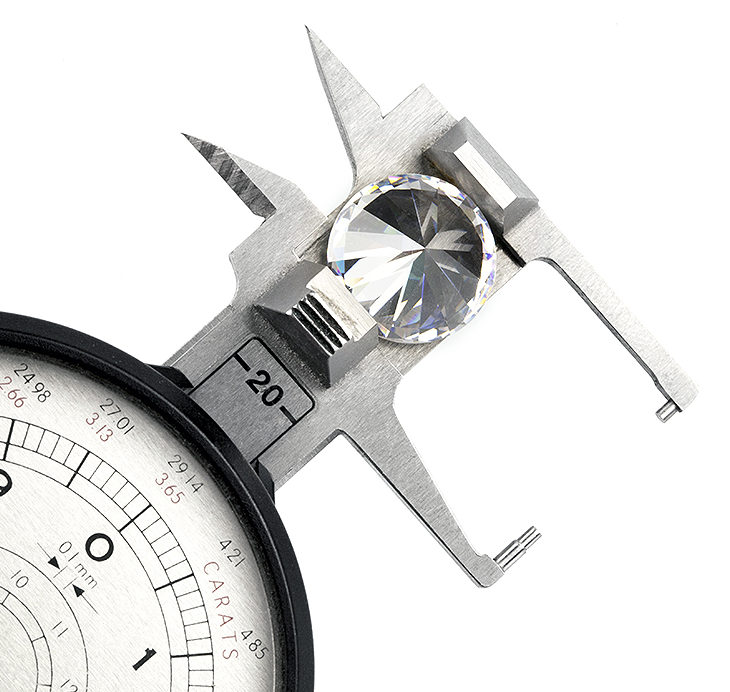
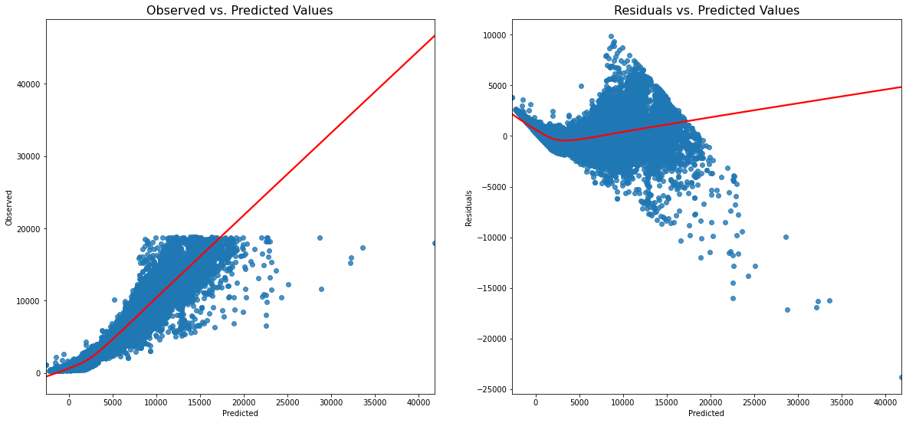
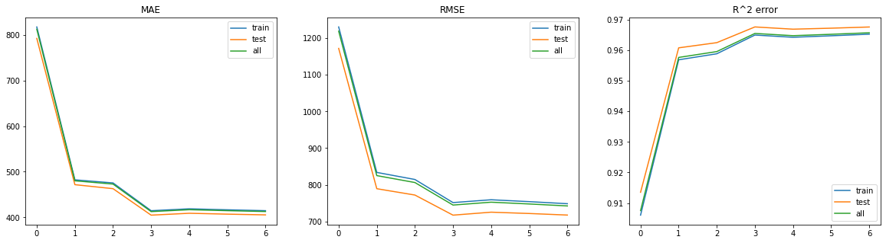
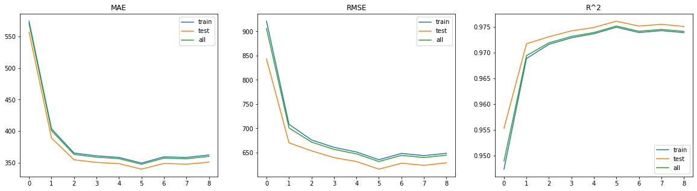

# Kaggle Diamond competition   

The goal of this competition is find the best statistical predictive model for finding the price of a diamond given specifications of them as its carat (weight), the quality of its cut, its color, clarity, depth, width of its top, lenght, width, depth and price. 

In order to achive this goal, competitors get two different dataframes: one with 40455 rows with all the spects mentioned above; and another one with 13485 rows and all the spects but the price. The idea is work and train the model with the dataframe that has the price, and deliver a new dataframe with just the predicted prices of the second dataframe, so Kaggle can compare those with the real prices and see what the Root Mean Score Error is. 

The lower the RMSE is, the better the model. The winner will be the one who gets the lower RMSE.

## Approach

### [Getting the data ready](https://github.com/EduOporto/ironhack-projects/blob/main/kaggle-project/data/dataset_setup.ipynb)

In order to get a good sense on how the dataframe is, I choose to start by looking for the types of the columns, check wether there are any null values or any other possible anomalies that could make my model not behave as expected.

The dataframe is pretty neat talking about null values, and nearly all its features are numerical, altough three of them seems to be categorical. The good point is this features refer to some aspects of the the diamond's quality, as the dataframe's description points:

 - cut: quality of the cut (Fair, Good, Very Good, Premium, Ideal)
 - color: diamond colour, from J (worst) to D (best)
 - clarity: a measurement of how clear the diamond is (I1 (worst), SI2, SI1, VS2, VS1, VVS2, VVS1, IF (best))

As it shows, this categorical data seems to follow an order, always from worst to best, so the choice is easy: translate those words into numbers, from 1 (worst) to whatever the higher number is. This way, categorical data is now [discrete](https://github.com/EduOporto/ironhack-projects/tree/main/kaggle-project/models_with_categoricals/data). 

After this work, data is ready to rock! Both dataframes have now no categorical data.

### [Simple Linear Regression](https://github.com/EduOporto/ironhack-projects/tree/main/kaggle-project/models_with_categoricals/simple_linear_reg)

In order to have a sense on how the dataset works altogether, I will make a first simple linear regression model and check on the different results ( 𝑅2 , MSE, RMSE). I will perform this separating the data in test and train chunks, comparing the results with each of the groups.

Checking first on the correlation matrix, I can see there are some features highly correlated among them, specially the ones related to the weight and the size of the diamond. I try different linear regression models dropping some of them or all of them, getting some small improvements that can guide me afterwards.

### [Lasso Models](https://github.com/EduOporto/ironhack-projects/tree/main/kaggle-project/models_with_categoricals/lasso_models)

As some of the coefficients returned by the simple linear regression model were way much bigger than the others, I try now to attemp some regularization over the data appliying LASSO regressions, in order to shrink the coefficients of our model towards zero.

After playing with the number of features and try also some combinations of LASSO and cross validation, I dicide to upload a [first attemp to Kaggle](https://github.com/EduOporto/ironhack-projects/blob/main/kaggle-project/models_with_categoricals/submissions/submission.csv), which gives me no great results. Anyway, the idea of LASSO regressions seems to be appropiate, although I still need to find its perfect match.

### [Polynomial Regression and LassoCV](https://github.com/EduOporto/ironhack-projects/blob/main/kaggle-project/models_with_categoricals/polynomial_regr/polynomial_regr.ipynb)

I start this attemp checking on the assumptions for the Linear Regressions, in order to see if it is necessary to apply any corrections on the data. After some plots and trys, I can confirm that this data has no linearity, a strong multicollinearity for some of the features, no homoscedasticity and no autocorrelation among its residuals.

After some internet research on how to correct this problems, I found a great [explaination](https://towardsdatascience.com/machine-learning-with-python-easy-and-robust-method-to-fit-nonlinear-data-19e8a1ddbd49) about Polynomial Regressions and LASSO models with Cross Validation working altogether, something that corrects some of the problems I am facing with the actual data. Given that, I decide to attemp this way.

First of all, I tried to create a pipeline with the sklearn function *make_pipeline*, which allows to combine multiple steps for our data in what is an improved model. In this case, I combined the sklearn processing function called *PolynomialFeatures*, in order to give the data different degrees of polynomials and see how this improves or not the data in the LassoCV model that is immediately after in the pipeline. 

All this is wrapped in a [function](https://github.com/EduOporto/ironhack-projects/blob/main/kaggle-project/models_with_categoricals/polynomial_regr/poly_lasso_cv.py), which gets an X (independent features), a y (target feature) and the size of the splitted test set; and also a minimum and maximum degrees, in order to create a range through which it iterates, generating different models with those degrees, fitting them for the train sets, making predictions for train, test and all the data, and collecting the results on Mean Average and Root Mean Squared Errors, and the $R^2$ values. This results are saved in three different dictionaries, which are returned in order to be plotted.

What the latter makes is fit the model along a regularization path, making the RMSE value half of it was in my first submission. As great as it sounds, I decide to make predictions for the 'non-priced' dataset and upload a [second submission](https://github.com/EduOporto/ironhack-projects/blob/main/kaggle-project/models_with_categoricals/submissions/poly_lasso_sub1.csv), which accomplish with the expected and gives me an RMSE smaller than 800. The goal of fitting a model with a RMSE lower than 1000 is finally achieved, but there is some room for improvement.

### [Polynomial Regression and LassoCV with feature dropping](https://github.com/EduOporto/ironhack-projects/blob/main/kaggle-project/models_with_categoricals/polynomial_regr/polynomial_regr_drop.ipynb)

For this, I perform the same pipeline quoted above, but with three different combinations of data: dropping the features related to the size of the diamond (x, y and z), dropping the feature related to the weight of the diamond (carat), and dropping just the width and the depth of the diamond. 

From all those, the best performance goes to the model fitted without the size-related columns, with an RMSE that is under the 650 points, an MAE under the 350, and an $R^2$ around 0.97.

Given this, I make my [third submission](https://github.com/EduOporto/ironhack-projects/blob/main/kaggle-project/models_with_categoricals/submissions/poly_lasso_sub_drop.csv) predicting the prices for the test dataset with the latter model.

