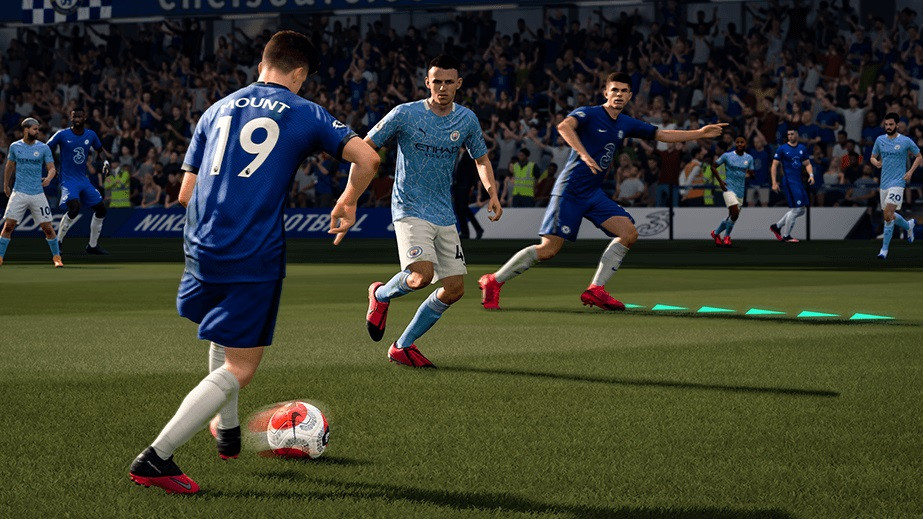
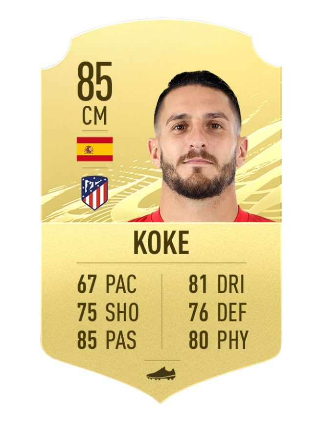
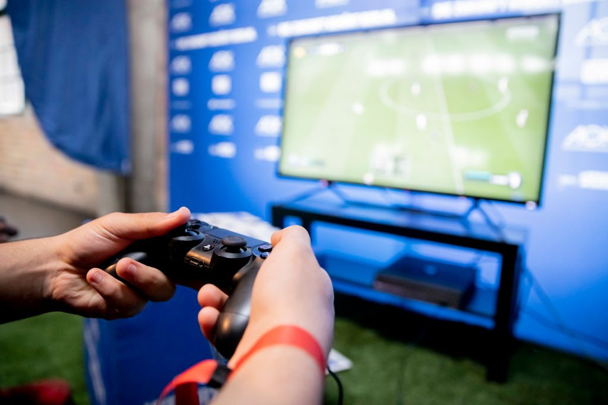

# Fifa 19 stats vs real life comparison

EA Sports' FIFA is by far one of the most popular videogames, able to gather and entertain the sparetime of **more than 10 million players worldwide**. The madness is so that thousands of people are proffessionally dedicated to it, either individually or in teams, and performing in national and international competitions with **prizes of up to 500,000 dollars**. Not less important is the business behind the game, which makes players to spend money on cards, in order to build their own teams with the best players: the better the player the more expensive his card is.

Each year the world stops with a new version release, and players discuss about its features, specs and developments regarding the past version. Something that also brings up huge debates are the statistics the game assign to the football players. It is such that even some of them who play often (some are always playing) complain publicly about a shooting or a pace lower than expected.

That is why I would like to check how accurate those statistics are, comparing them with the their performance in real life. For this research, I will use the [data available for the FIFA 19 version of the game](https://www.kaggle.com/stefanoleone992/fifa-20-complete-player-dataset), as it corresponds to the 18/19 season, the last ordinary one before the COVID-19 breakout, where the players were able to perform without any long breaks.

FIFA stat cards are made by seven different chunks of data:

 - **Overall**: the mark the game gives to the player in general.
 - **Pace**: the speed and acceleration of the player.
 - **Shooting**: finishing, long shots, shot power, positioning, penalties and volleys.
 - **Passing**: short and long passing, vision, free kick accuracy, crossing and curve.
 - **Physical**: strenght, stamina, aggression and jumping.
 - **Defending**: marking, tackles, interceptions and heading accuracy.
 - **Dribbling**: dribbling, ball control, agility, balance and reactions.

In order to traduce this data and compare it with real life data, I will scrap data from the website [fbref.com](https://fbref.com/), as it offers accurate figures about the shooting, passing, dribbling and defending skills the players had at the end of the 18/19 season. I did not find any accurate data about the physical and pace skills of the players, so I will just compare the four stats named above.

As FIFA 19 was integrate by nearly 18,000 football players, I dicided to close the hedge to those whose overall stat is of 85 and above, which reduces my frame to just 111 players.

My first task will be clean the data and prepare the columns I will use. Lucky for me, the original dataframe is fully neat, so I don't need to get rid of null values or unsuitable data.

Through the names of the players and with help of the [Selenium API](https://selenium-python.readthedocs.io/), I will get each of the unique links they got in [fbref.com](https://fbref.com/), so I can scrape the web afterwards. All this process will be performed in the document [*dataframes.ipynb*](https://github.com/EduOporto/ironhack-projects/blob/main/pipelines-project/dataframes.ipynb).

Once the links are ready, I will build two *scraper* functions (one for field players and another one for goalkeepers), both separated from the rest of the work in [*scraper.py*](https://github.com/EduOporto/ironhack-projects/blob/main/pipelines-project/scraper.py) . I will use them in [*players_scraper.ipynb*](https://github.com/EduOporto/ironhack-projects/blob/main/pipelines-project/players_scraper.ipynb), saving the resulting dataframes in [*.csv*](https://github.com/EduOporto/ironhack-projects/tree/main/pipelines-project/csv) documents, so I can clean them and extract the information I want in the format I need easily in the [*cleaning_results.ipynb*](https://github.com/EduOporto/ironhack-projects/blob/main/pipelines-project/cleaning_results.ipynb).

Finally, I will gather game and real data in *results.ipynb*, analyzing the results and plotting them.

